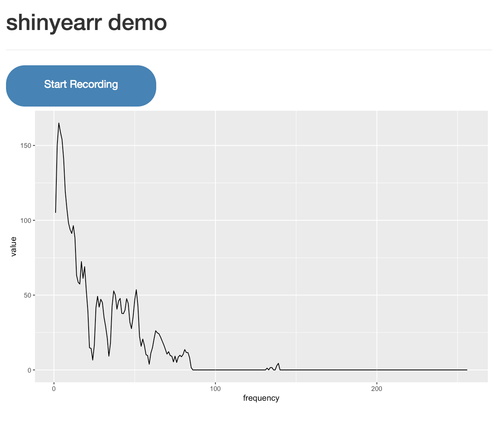

# shinyearr

An R package that contains a simple shiny module that allows audio recording and export
of the fourier transformed data. For an example of the kind of apps you can build with this see this
[machine learning data collection tool](https://nickstrayer.shinyapps.io/shinyearr_demo/) that allows capture and export of tagged
speech/sound data for training and testing of speech recognition models. 

## Installation

`shinyearr` is not yet on CRAN so to install you must use `devtools` github installation tool.

```r
devtools::install_github("nstrayer/shinyearr")
```

## Use

There are not many options with `shinyearr` yet. To use, like any [shiny module](https://shiny.rstudio.com/articles/modules.html), you
need to call `shinyearrUI(id)` in your UI function and `callModule(shinyearr, id)` in your server. Below is a simple hello world for `shinyearr`.

__ui__

```r
library(shiny)
library(shinyearr)
library(tidyverse)
library(forcats)

ui <- fluidPage(
  titlePanel("shinyearr demo"),
  hr(),
  shinyearrUI("my_recorder"),
  plotOutput("frequencyPlot")
)
```

__server__

```r
server <- function(input, output) {

  #object to hold all your recordings in to plot
  rvs <- reactiveValues(
    recording = data_frame(value = numeric(), frequency = integer())  
  )

  #set up server component of shinyearr
  recorder <- callModule(shinyearr, "my_recorder")

  observeEvent(recorder(), {
    my_recording <- recorder()

    #make dataframe of the results.
    rvs$recording <- data_frame(value = my_recording, frequency = 1:256)

    # Generate a plot of the recording we just made
    output$frequencyPlot <- renderPlot({
      ggplot(rvs$recording, aes(x = frequency, y = value)) +
        geom_line()
    })
  })
}

# link together ui and server and run the application
shinyApp(ui = ui, server = server)
```

This code will produce an app that looks like this:




Pressing the record button initiates recording, pressing it again will end the recording.

The recording, in the form of an array of length 256 representing frequency bins, is then
reactively updated to the variable you assigned `shinyearr()` to.

This app then parses the array into a dataframe and plots the data as a line plot to the page.

## Known Problems / Upgrades Needed

__Bugs/Limitations__

- Doesn't work within the RStudio view pane.
        - For some reason RStudio blocks click events within the viewer pane.
        - Apps will work fine if run within a browser like chrome.
- Doesn't work on iPhones/iPads.
        - Unfortunately apple does not allow web browsers to access the microphone on their devices.
        - This may change in future updates, but for now it works on android devices and regular computers.

__Future Features__

- Expand exportation options.
        - Currently the package only exports audio recordings as fourier transformed signals with 256 bins.
        - In future updates this may be expanded to an arbitrary number of bins.
        - Exporting raw waveforms is also of interest but not particularly useful for modeling.
